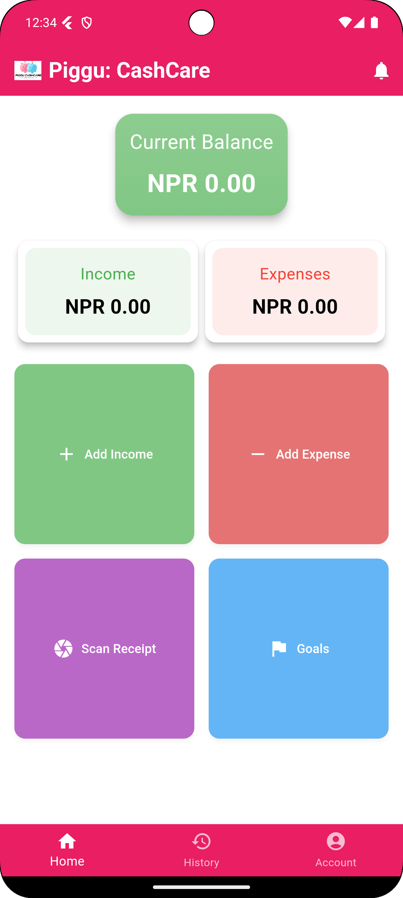
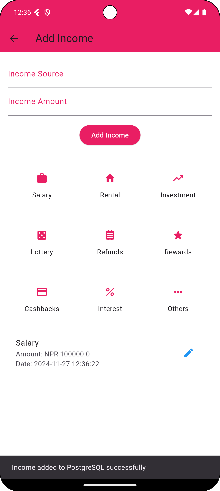
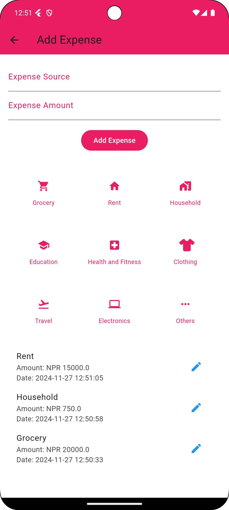
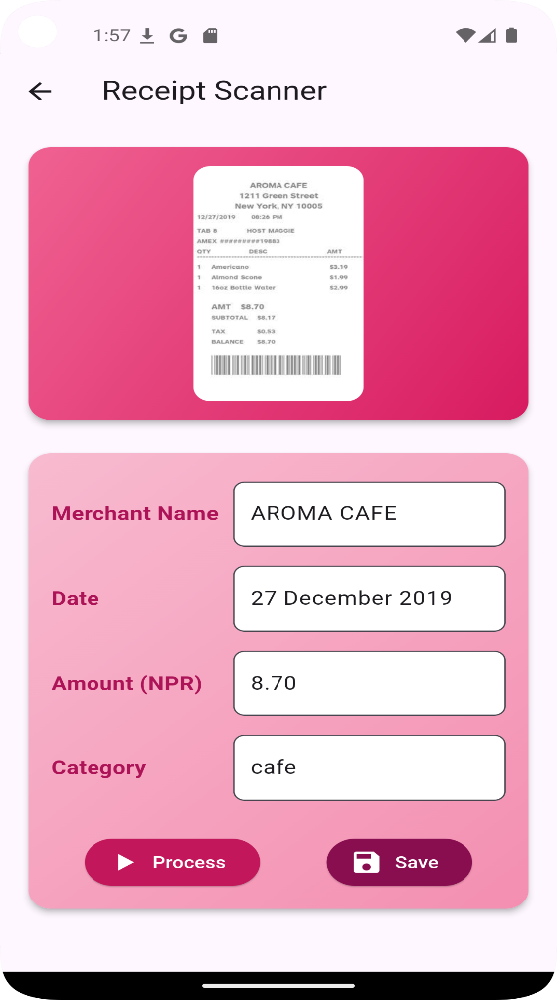
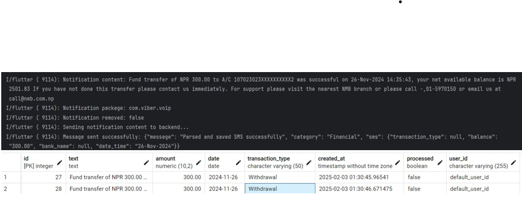
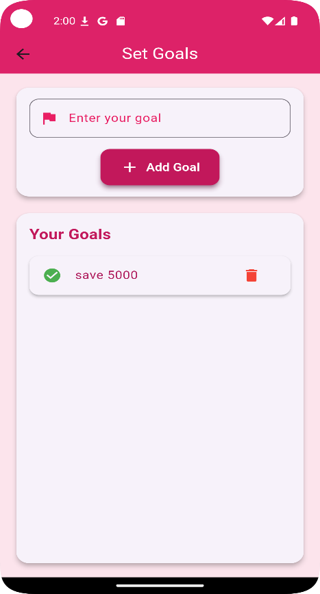
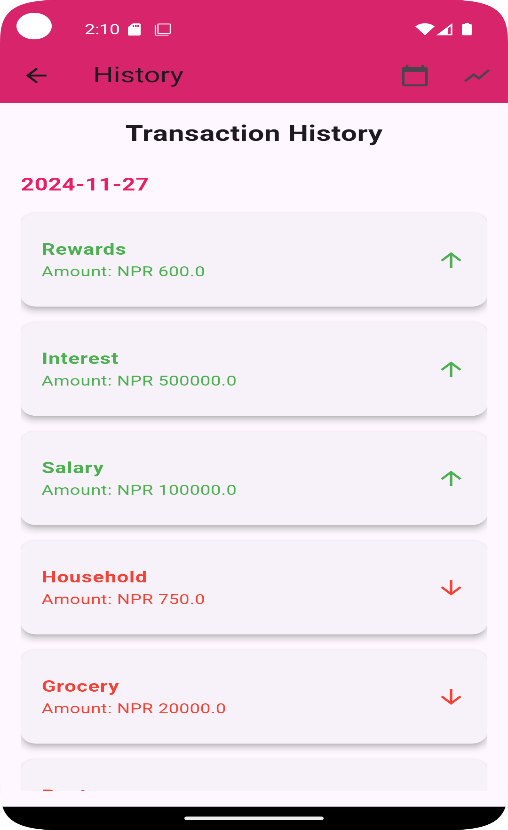
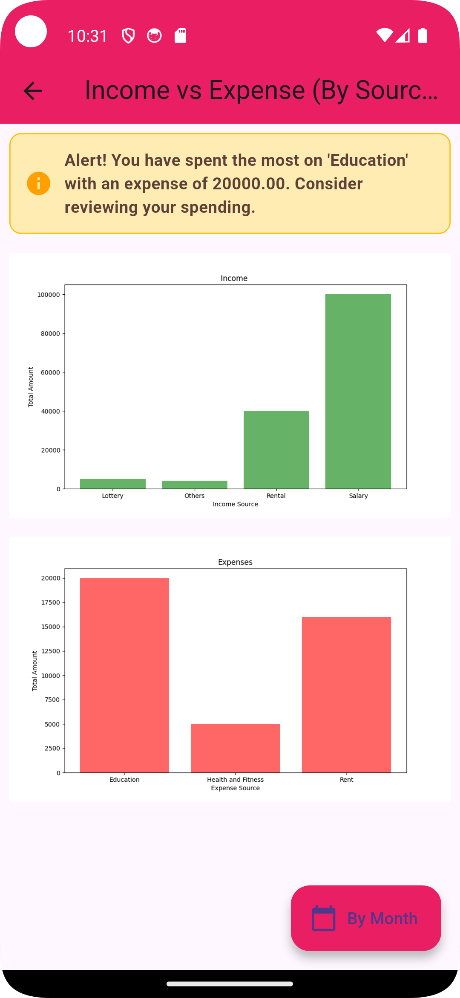
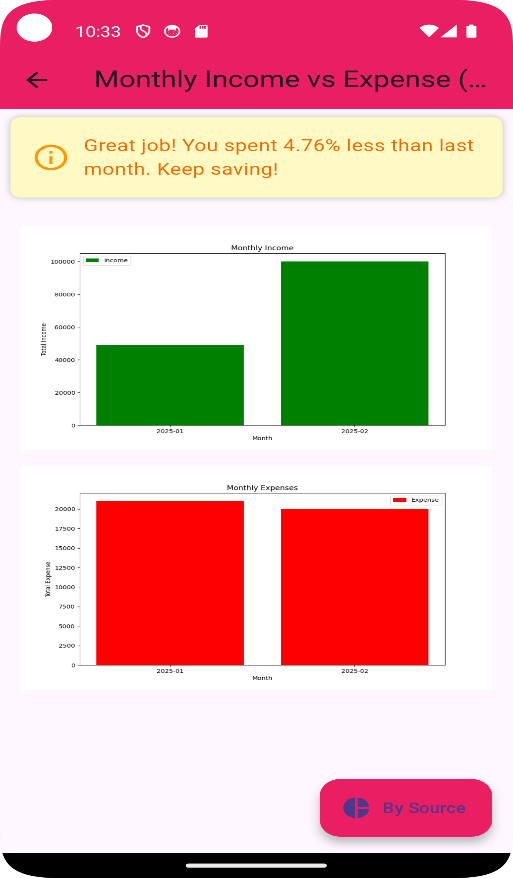
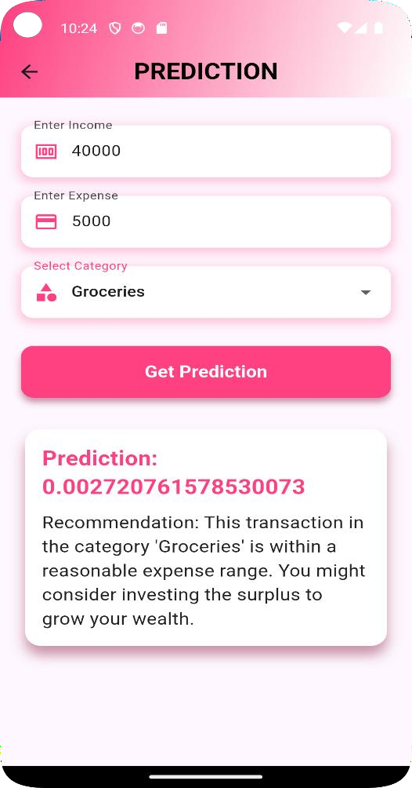

# 🐷 Piggu:CashCare
### *Your Personal Finance Companion*

> A smart, cross-platform personal finance management app built for Nepal — and beyond.


---

## 📱 About

**Piggu:CashCare** is a personal finance tracking mobile application designed to help individuals — especially in Nepal — take control of their finances. It combines automated expense tracking, receipt scanning, SMS parsing, and AI-powered spending recommendations into one intuitive mobile app.

Built as a Minor Project at **Kathmandu Engineering College, Tribhuvan University** (CT 654).

---

## ✨ Features

| Feature | Description |
|---|---|
| 💰 **Income & Expense Tracking** | Log transactions by category with real-time balance updates |
| 📷 **Receipt Scanning (OCR)** | Snap a receipt and auto-extract merchant, date, and amount |
| 📩 **SMS Parsing** | Auto-detect transactions from eSewa, Khalti, and bank SMS notifications |
| 🎯 **Goal Setting** | Set savings goals with deadlines and receive reminder notifications |
| 🤖 **ML Predictions** | XGBoost-powered spending analysis classifies habits as Healthy or Risky |
| 📊 **Financial Charts** | Interactive income vs expense charts by month and category |
| 🔔 **Smart Notifications** | Real-time alerts for goal deadlines and spending patterns |
| 🔐 **Secure Auth** | Firebase authentication with email verification and password reset |

---

## 🛠️ Tech Stack

### Frontend
- **Flutter** (Dart) — cross-platform mobile app (Android, iOS, Web)

### Backend
- **Python / Django REST Framework** — API server
- **PostgreSQL** — relational database for transactions and user data
- **Firebase** — authentication and Firestore for profile data

### Machine Learning
- **XGBoost** — spending pattern classification (Healthy / Risky)
- **Tesseract OCR** — receipt text extraction
- **Pandas / Matplotlib** — data processing and chart generation

---

## 🏗️ System Architecture

```text
Flutter App
   ↓
Django REST API
   ↓
PostgreSQL Database
   ↓
ML Prediction Engine (XGBoost)
```

## 🚀 Getting Started

### Prerequisites
- Flutter SDK 3.x
- Python 3.10+
- PostgreSQL
- Firebase project with authentication enabled

### Backend Setup

```bash
cd piggu_backend
pip install -r requirements.txt
```

Create a `.env` file in `piggu_backend/`:

```env
SECRET_KEY=your_django_secret_key
DB_NAME=piggu
DB_USER=your_db_user
DB_PASSWORD=your_db_password
DB_HOST=localhost
DB_PORT=5432
FIREBASE_KEY_PATH=/path/to/your/serviceAccountKey.json
```

Run migrations and start the server:

```bash
python manage.py migrate
python manage.py runserver
```

### Flutter Setup

```bash
flutter pub get
flutter run
```

---

## 📂 Project Structure

```
Piggu-CashCare/
├── lib/                        # Flutter app source
├── piggu_backend/              # Django backend
│   ├── piggu/                  # Core app (income, expense, goals)
│   ├── graphs/                 # Chart generation APIs
│   ├── piggu_backend/          # Django settings & URLs
│   └── requirements.txt        # Python dependencies
├── android/                    # Android platform files
├── ios/                        # iOS platform files
└── pubspec.yaml                # Flutter dependencies
```

---

## 🤖 ML Prediction System

The prediction system uses **XGBoost** to classify user spending behavior:

| Prediction | Expense Ratio | Recommendation |
|---|---|---|
| ✅ Healthy | ≤ 50% of income | Keep saving and investing |
| ⚠️ Healthy | 50–70% of income | Consider increasing savings |
| 🔴 Risky | > 70% of income | Cut unnecessary costs |
| 🚨 Risky | > 100% of income | Reduce expenses or increase income |

---

## 📸 Screenshots

<table>
  <tr>
    <td align="center">
      <b>Home Dashboard</b><br/>
      
    </td>
    <td align="center">
      <b>Add Income</b><br/>
      
    </td>
    <td align="center">
      <b>Add Expense</b><br/>
      
    </td>
  </tr>

  <tr>
    <td align="center">
      <b>Receipt Scanner</b><br/>
      
    </td>
    <td align="center">
      <b>SMS Parsing</b><br/>
      
    </td>
    <td align="center">
      <b>Goals</b><br/>
      
    </td>
  </tr>

  <tr>
    <td align="center">
      <b>Transaction History</b><br/>
      
    </td>
    <td align="center">
      <b>Income vs Expense Chart</b><br/>
      
    </td>
    <td align="center">
      <b>Monthly Income Chart</b><br/>
      
    </td>
  </tr>

  <tr>
    <td align="center">
      <b>Prediction System</b><br/>
      
    </td>
  </tr>
</table>

---


## 👥 Team

Built by a team of 4 as a Minor Project at Kathmandu Engineering College.

| Name |
|------|
| Neha Khatri |
| Prasiddha Raj Gautam |
| Sudip Shrestha |
| Susan Baral |

---

## 🔮 Future Enhancements

- 🏦 **Bank Integration** — Direct connection with banks for automated imports
- 🔒 **Biometric Authentication** — Fingerprint and face unlock
- 🧠 **Advanced AI Insights** — Predictive budgeting and deeper spending analysis

---

## 🔗 Project Links

- [GitHub Profile](https://github.com/neha-khatry)
- [LinkedIn Profile](https://www.linkedin.com/in/neha-khatry/)

---

## 📄 License

This project is for academic purposes. All rights reserved by the project team.

---

<p align="center">Made with 💖 in Nepal</p>


